---
## Front matter
lang: ru-RU
title: Отчёт по выполнению лабораторной работы №1
subtitle: Установка и настройка Fedora Sway
author:
  - Пашутина Анна Алексеевна
institute:
  - Российский университет дружбы народов, Москва, Россия
date: 2 марта 2026

## Format
format:
  beamer:
    toc: false
    toc-title: Содержание
    slide-level: 2
    aspectratio: 169
    section-titles: true
    theme: Madrid
    colortheme: default
    fonttheme: professionalfonts
    header-includes:
      - \metroset{progressbar=frametitle,sectionpage=progressbar,numbering=fraction}
      - \makeatletter
      - \beamer@ignorenonframefalse
      - \makeatother
---

# Информация

## Докладчик

:::::::::::::: {.columns align=center}
::: {.column width="70%"}

  * Пашутина Анна Алексеевна
  * Студентка
  * Российский университет дружбы народов
  * 1032253642@pfur.ru

:::
::: {.column width="30%"}

:::
::::::::::::::

## Цель

Целью данной работы является приобретение практических навыков установки операционной системы на виртуальную машину, настройки минимально необходимых для дальнейшей работы сервисов.

# Задание

- Установка операционной системы
- Установка драйверов для VirtualBox
- Настройка раскладки клавиатуры
- Установка имени пользователя и названия хоста
- Подключение общей папки
- Установка программного обеспечения для создания документации
- Домашнее задание

## Установка Fedora Sway

Для начала создадим виртуальную машину. Укажем имя ВМ и адрес к загрузочному носителю.

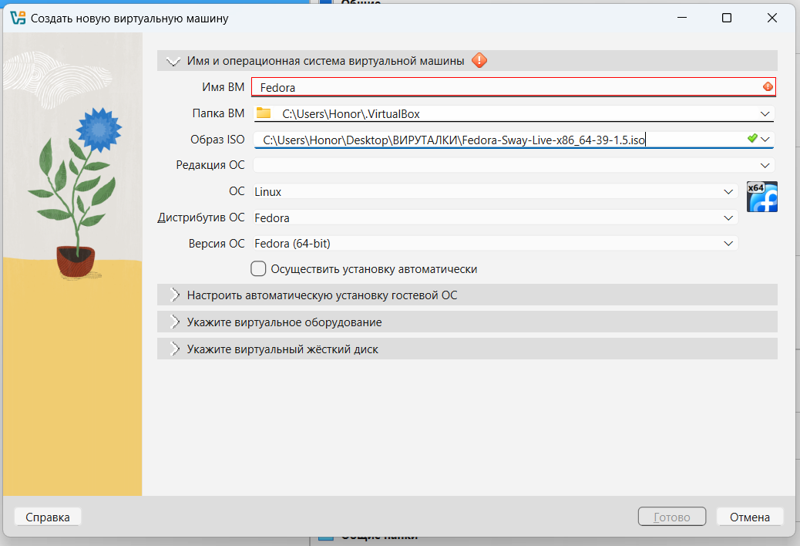{height=66%}

## Установка Fedora Sway

Далее выделим основную память.

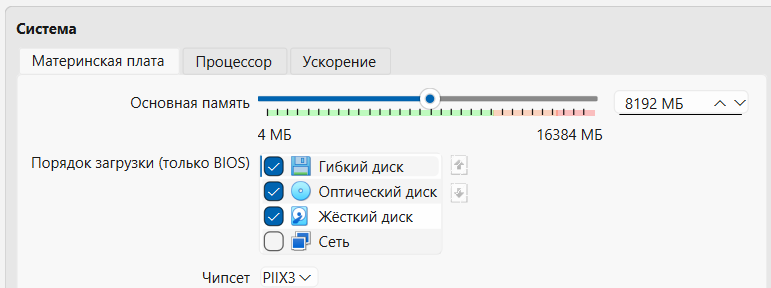{height=66%}

## Установка Fedora Sway

Далее выделим число ЦПУ и предел нагрузки для ВМ.

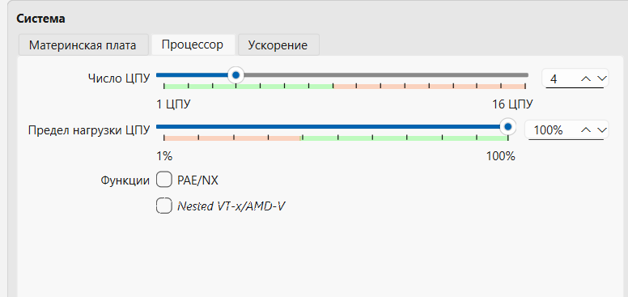{height=66%}

## Установка Fedora Sway

Выделим виртуальный диск размером в 80 ГБ.

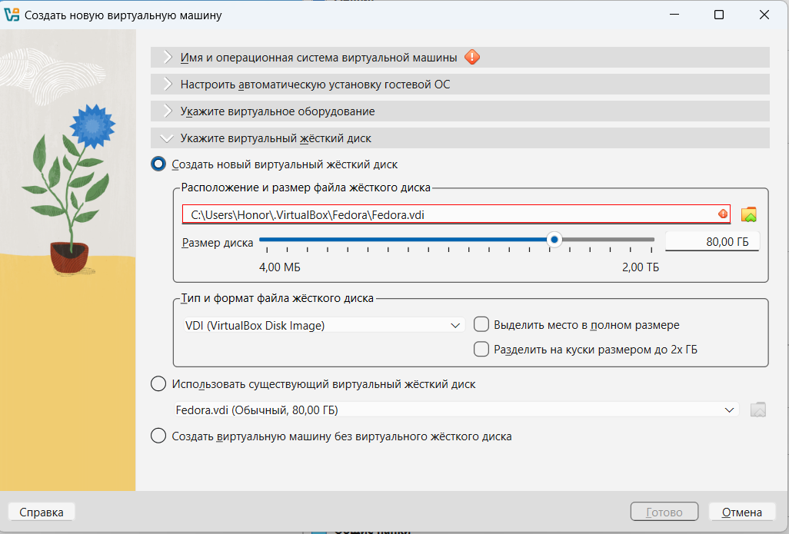{height=66%}

## Установка Fedora Sway

Далее выделим видеопамять в 128 МБ и включим 3D ускорение.

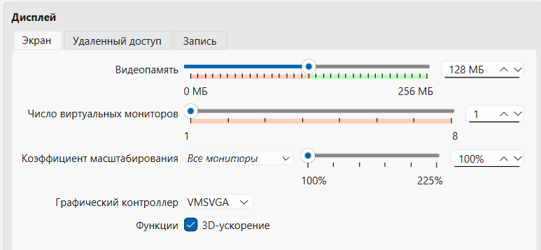{height=66%}

## Установка Fedora Sway

Запустим ВМ и запустим установщик Liveinst.

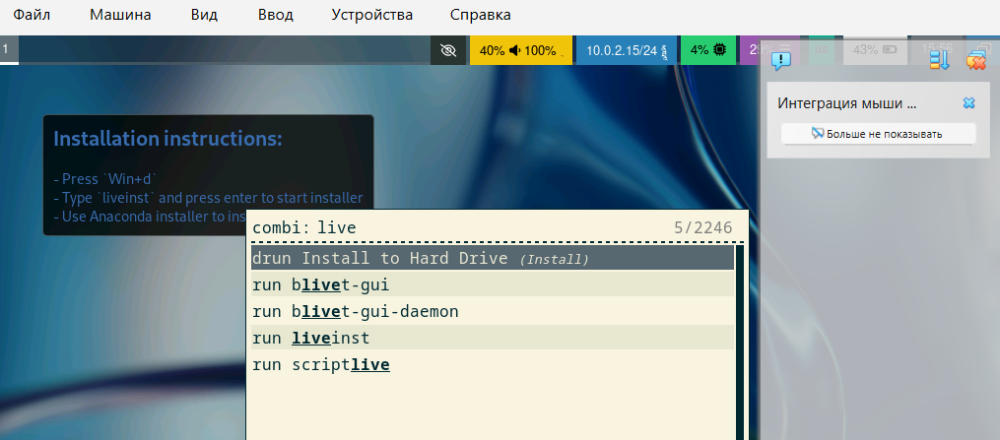{height=66%}

## Установка Fedora Sway

Выберем язык для нашей ВМ.

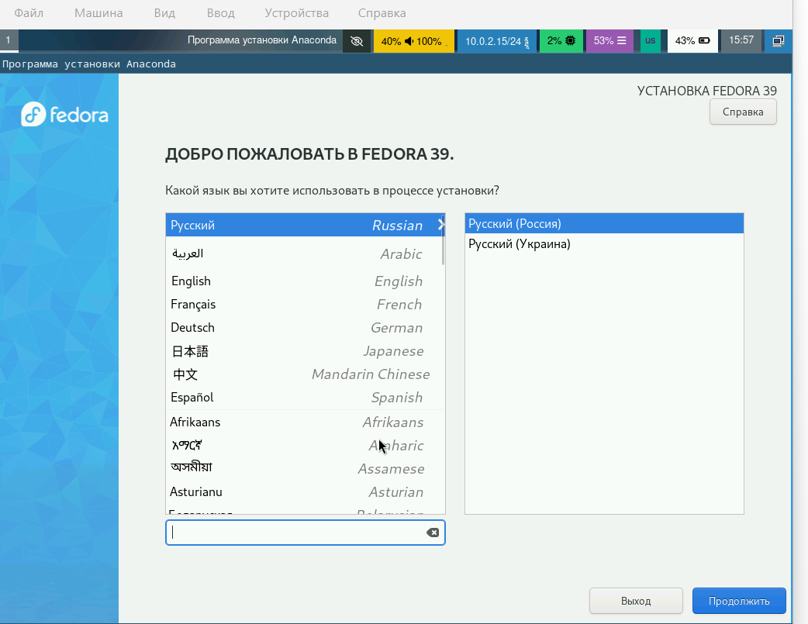{height=66%}

## Установка Fedora Sway

Выберем диск для установки.

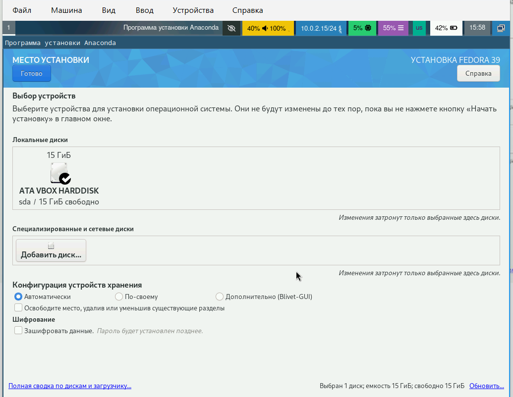{height=66%}

## Установка Fedora Sway

Включим учетную запись root и укажем пароль для нее.

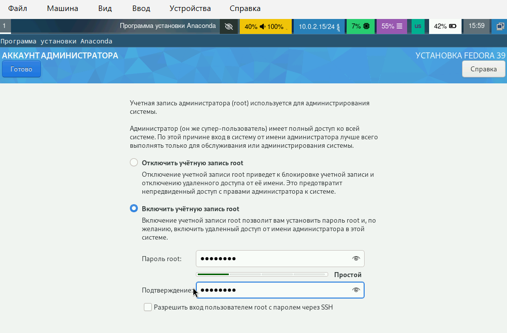{height=66%}

## Установка Fedora Sway

Создадим свою учетную запись, укажем имя пользователя.

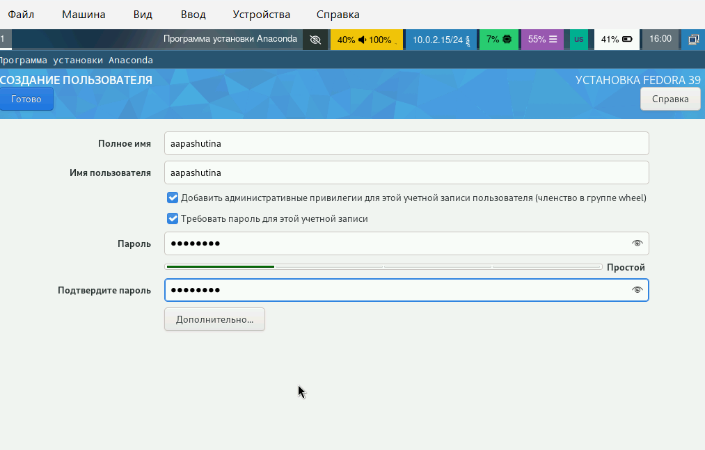{height=66%}

## Установка Fedora Sway

Далее начался этап загрузки, после которого мы можем изъять загрузочный диск.

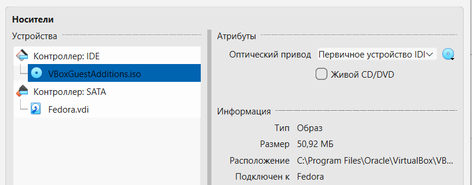{height=66%}

## Установка Fedora Sway

Загрузим ВМ и перейдем в режим суперпользователя с помощью команды sudo -i.

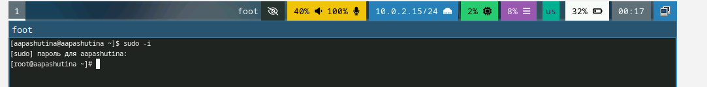{height=66%}

## Установка Fedora Sway

Обновим все пакеты с помощью команды dnf.

{height=66%}

## Установка Fedora Sway

Установим mc и tmux с помощью команды dnf.

{height=66%}

## Установка Fedora Sway

Установим dnf-automatic.

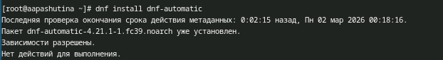{height=66%}

## Установка Fedora Sway

Включим сценарий автообновления.

{height=66%}

## Установка Fedora Sway

Выключим SELinux, отредактировав файл /etc/selinux/config следующим образом.

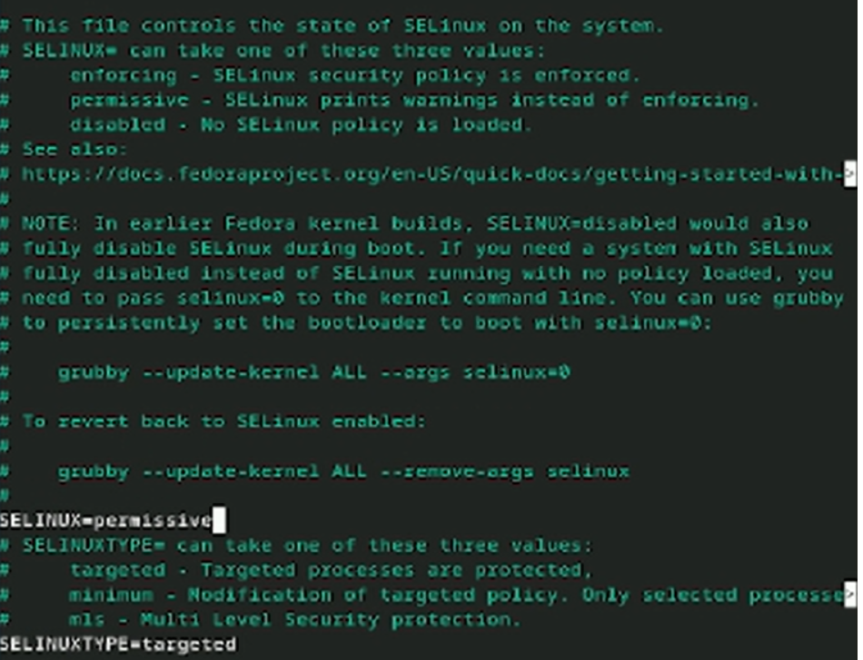{height=66%}

## Установка Fedora Sway

Запустим tmux.

{height=66%}

## Установка Fedora Sway

Перейдем в режим root.

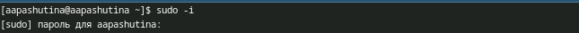{height=66%}

## Установка Fedora Sway

Установим Development Tools.

{height=66%}

## Установка Fedora Sway

Установим dkms с помощью команды dnf.

{height=66%}

## Установка Fedora Sway

Подключим образ диска дополнений гостевой ОС.

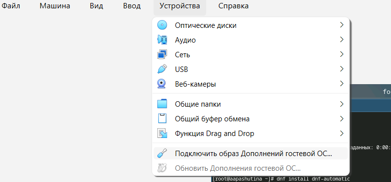{height=66%}

## Установка Fedora Sway

Примонтируем его и запустим скрипт-установщик.

{height=66%}

## Установка Fedora Sway

Создадим файл конфигурации клавиатуры.

{height=66%}

## Установка Fedora Sway

Вставим в него предложенный текст.

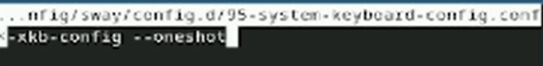{height=66%}

## Установка Fedora Sway

Теперь поменяем настройки клавиатуры на следующие.

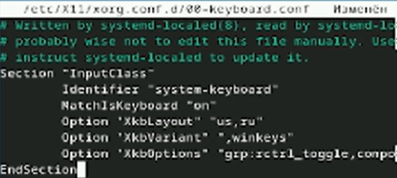{height=66%}

## Установка Fedora Sway

Поменяем название хоста согласно соглашению об именовании с помощью команды hostnamectl.

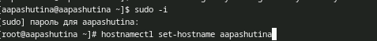{height=66%}

## Установка Fedora Sway

Добавим нашего пользователя в группу vboxsf.

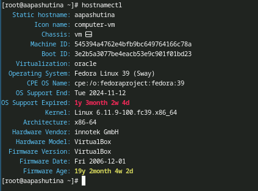{height=66%}

## Установка Fedora Sway

Создаем общую папку в терминале хост-машины.

{height=66%}

## Установка Fedora Sway

Теперь установим pandoc.

{height=66%}

## Установка Fedora Sway

Скачаем pandoc-crossref, распакуем его с помощью tar и перенесем в папку /usr/local/bin.

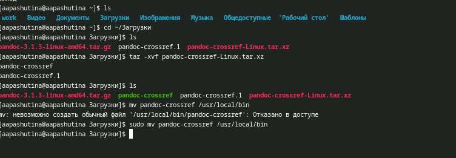{height=66%}

## Установка Fedora Sway

Установим texlive.

{height=66%}

# Домашнее задание

## Домашнее задание

:::::::::::::: {.columns align=center}
::: {.column width="60%"}

С помощью dmesg получим следующую информацию:

* Версия ядра Linux (Linux version) — 6.11.9
* Частота процессора (Detected Mhz processor) — 2611.210
* Модель процессора (CPU0) — Core i5-13420H
* Объём доступной оперативной памяти (Memory available) — 8071424K
* Тип обнаруженного гипервизора (Hypervisor detected) — KVM

:::
::: {.column width="30%"}

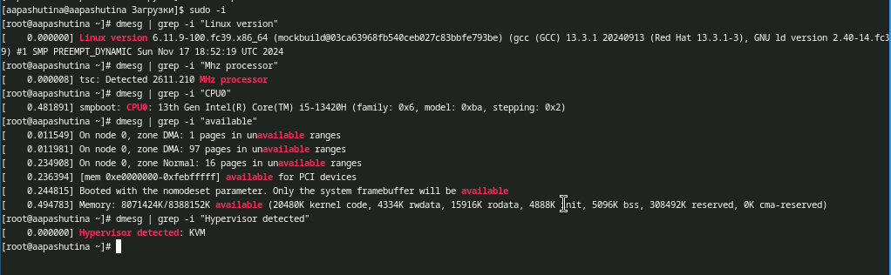{height=66%}

:::
::::::::::::::

## Домашнее задание

* Тип файловой системы корневого раздела — BTRFS
* Последовательность монтирования файловых систем — EXT4-fs

{height=80%}

# Выводы

## Выводы

Были получены навыки работы в системе Fedora Sway: проведена установка системы, установлены необходимые для последующей работы пакеты и произведена базовая настройка системы.

