---
## Author
author:
  name: Пашутина Анна Алексеевна
  degrees: 
  orcid: 
  affiliation:
    - name: Российский университет дружбы народов
      country: Российская Федерация
      postal-code: 117198
      city: Москва
      address: ул. Миклухо-Маклая, д. 6
## Title
title: Лабораторная работа №2
subtitle: "Первоначальная настройка git"
license: CC BY
date: today
date-format: "YYYY-MM-DD"

## Fonts
mainfont: Liberation Serif
sansfont: Liberation Sans
monofont: Liberation Mono
mainfontoptions: Ligatures=TeX
romanfontoptions: Ligatures=TeX
sansfontoptions: Ligatures=TeX,Scale=MatchLowercase
monofontoptions: Scale=MatchLowercase,Scale=0.9
---

# Информация

## Докладчик

:::::::::::::: {.columns align=center}
::: {.column width="70%"}

  * Пашутина Анна Алексеевна
  * Студентка
  * Российский университет дружбы народов
  * 1032253642@rudn.ru
  * группа НПИ-Бл-02-25

:::
::: {.column width="30%"}

:::
::::::::::::::

# Цель работы

- Изучить идеологию и применение средств контроля версий
- Освоить умения по работе с git

# Задание

- Создать базовую конфигурацию для работы с git
- Создать ключ SSH
- Создать ключ PGP
- Настроить подписи git
- Зарегистрироваться на Github
- Создать локальный каталог для выполнения заданий по предмету

# Выполнение лабораторной работы

## Рис.1

- Для начала установим git. В моем случае уже установлен.

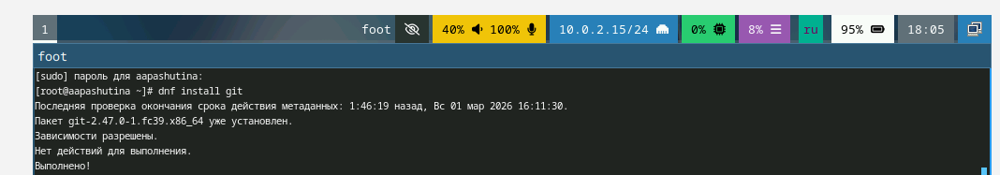

## Рис.2

- Теперь установим gh.

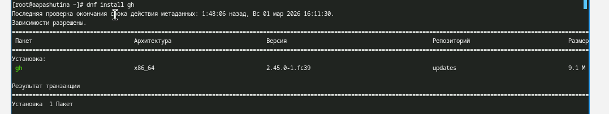

## Рис.3

- Далее зададим имя для владельца репозитория. В данном случае это мои фамилия и имя.

## Рис.4

- Теперь зададим почту. Я задала ту почту, на которую зарегистрирован мой аккаунт Github.

## Рис.5

- Настроим кодировку utf8 в выводе сообщений git.

## Рис.6

- Зададим имя начальной ветки, настроим параметры autocrlf и safecrlf.

## Рис.7

- Создадим ключ RSA размером 4096 бит.

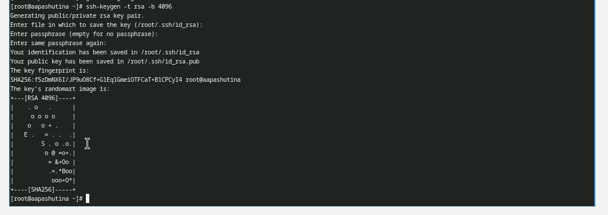

## Рис.8

- Теперь создадим ключ по алгоритму ed25519.

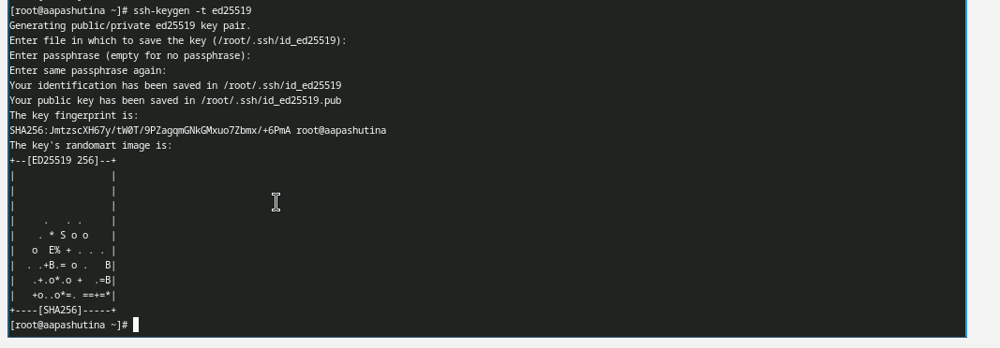

## Рис.9

- Теперь создадим ключ gpg. Выбираем из предложенных вариантов первый тип (RSA или RSA), размер задаем 4096 бит, срок действия выбираем 0.

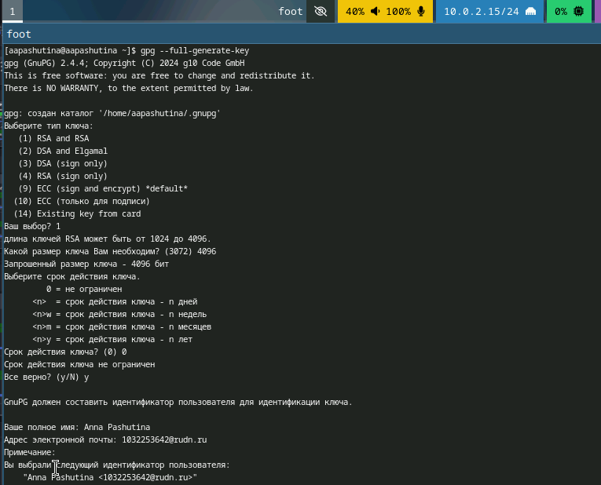

## Рис.10

- После вводим свои данные: имя и адрес эл.почты; после соглашаемся с генерацией ключа.

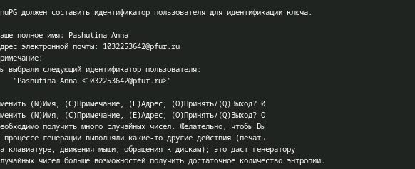

## Рис.11

- Далее выводим список pgp ключей.

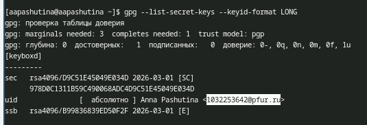

## Рис.12

- Копируем наш ключ в буфер обмена.

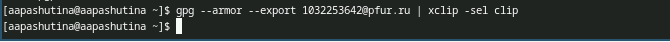

## Рис.13

- Вставляем этот ключ на github, задаем ему имя. У меня это имя Fedora.

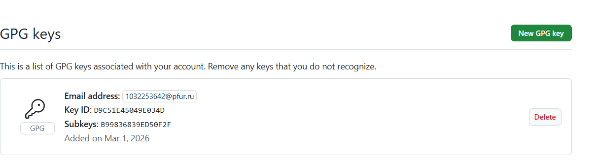

## Рис.14

- Теперь произведем настройку автоматических подписей.

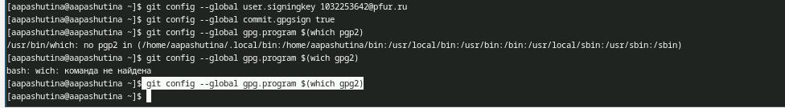

## Рис.15

- Теперь нам надо было авторизоваться на Github с помощью gh. Выбираю сайт для авторизации (Github), выбираю протокол (SSH), публичный SSH ключ (id_rsa.pub), имя для ключа (Fedora). В качестве способа авторизации выбираю браузер.

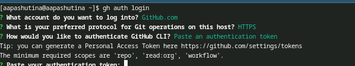

## Рис.16

- Теперь создаем рабочую директорию курса (у меня уже создана) и переходим в нее с помощью cd.

## Рис.17

- Далее создаем репозиторий для лабораторных работ из шаблона.

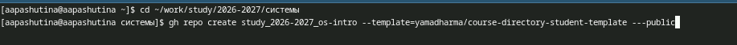

## Рис.18

- Клонируем его на свой компьютер.

## Рис.19

- Переходим в него с помощью cd и удаляем ненужные файлы (package.json) и создаем необходимые каталоги, записав в файл COURSE строку os-intro (наш текущий курс), прописываем make, чтобы нужные нам каталоги создались.

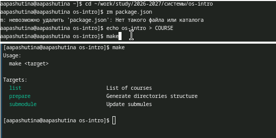

## Рис.20

- Теперь добавляем нашу папку для отправки с помощью git add .

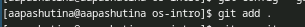

## Рис.21

- Делаем коммит, в котором указываем, что мы сделали структуру курса.

## Рис.22

- Отправляю файлы на сервер Github с помощью команды push.

# Выводы

- Была произведена настройка git
- Проведена его первоначальная конфигурация
- Созданы ключи для авторизации и подписи
- Создан репозиторий курса из предложенного шаблона
