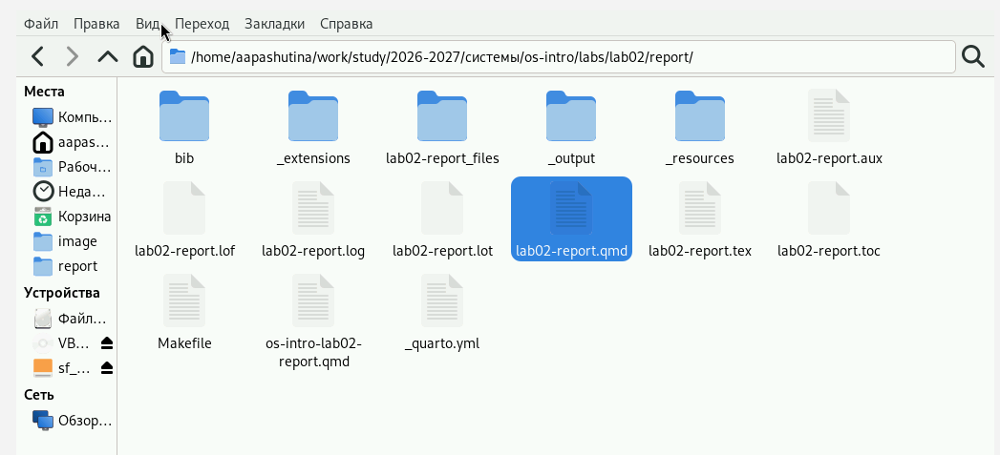
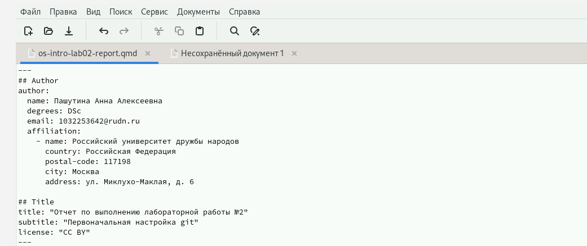
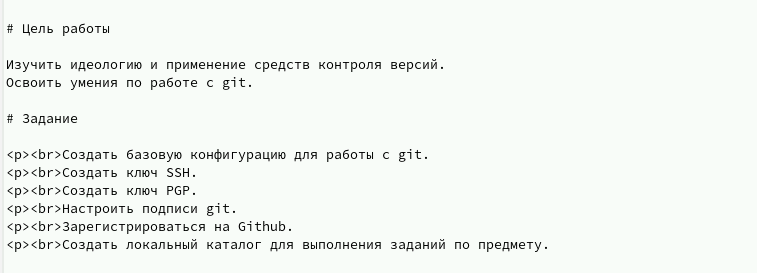
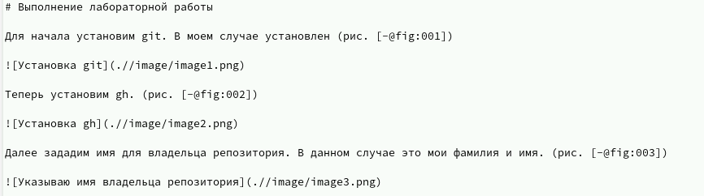
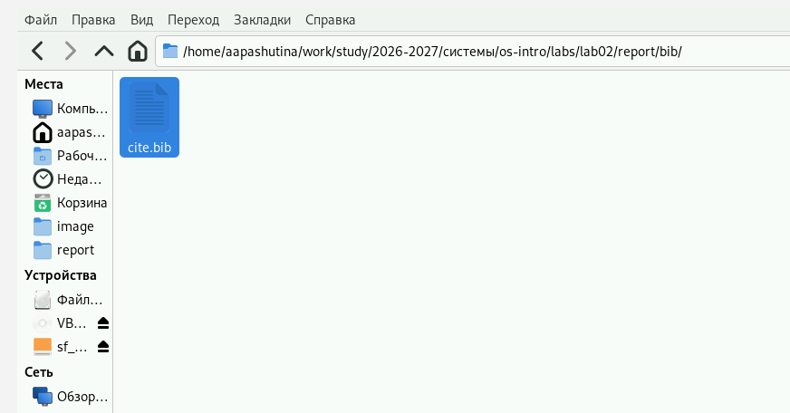
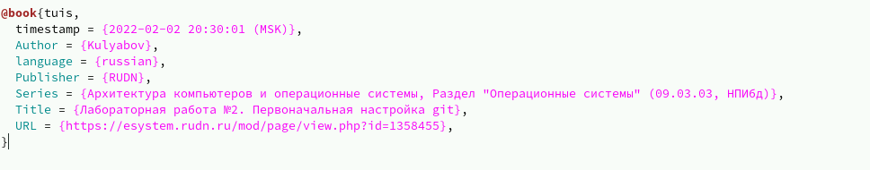
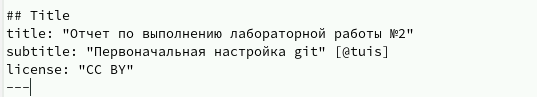

---
## Author
author:
  name: Пашутина Анна Алексеевна
  degrees: DSc
  orcid: 0000-0002-0877-7063
  email: 1032253642@rudn.ru
  affiliation:
    - name: Российский университет дружбы народов
      country: Российская Федерация
      postal-code: 117198
      city: Москва
      address: ул. Миклухо-Маклая, д. 6
## Title
title: Лабораторная работа №3
subtitle: Отчет лабораторной работы №2 в Markdown
license: CC BY
date: today
date-format: "YYYY-MM-DD"

## Fonts
mainfont: Liberation Serif
sansfont: Liberation Sans
monofont: Liberation Mono
mainfontoptions: Ligatures=TeX
romanfontoptions: Ligatures=TeX
sansfontoptions: Ligatures=TeX,Scale=MatchLowercase
monofontoptions: Scale=MatchLowercase,Scale=0.9

## Format for both PDF and HTML presentations
format:
  beamer:
    slide-level: 2
    aspectratio: 169
    theme: default
  revealjs:
    slide-level: 2
    theme: default
    transition: slide
---

# Информация

## Докладчик

:::::::::::::: {.columns align=center}
::: {.column width="70%"}

  * Пашутина Анна Алексеевна
  * Студентка НПИбд-02-25
  * Российский университет дружбы народов им. П. Лумумбы
  * 1032253642@rudn.ru

:::
::: {.column width="30%"}

:::
::::::::::::::

# Цель работы

- Изучить идеологию и применение средств контроля версий
- Освоить умения по работе с git

# Задание

- Сделать отчет по предыдущей лабораторной работе (№2) в формате Markdown
- Предоставить отчет №3 в формате pdf, docx и md

# Выполнение работы

## Рис.1

- Для начала открыть файл с отчетом второй лабораторной работы в формате md.

## Рис.2

- Поменяем титульный лист, указав автора отчета и его название.

## Рис.3

- Добавила цели и задания лабораторной работы №2.

## Рис.4

- Начfинаю копировать весь текст из файла лабораторной работы №2 в файл markdown. Подписываю скриншоты и обозначаю идентификаторы фотографий (# + fig:XXX), и ссылки на них ("-" + "@" + "fig:XXX").

## Рис.5

- Далее откроем файл с расширением .bib.

## Рис.6

- Заполним его, указав лекцию №2 к лабораторной работе №2 на сайте ТУИС.

## Рис.7

- Теперь добавляю перекрестную ссылку в цель работы.

# Выводы

- В результате выполнения лабораторной работы были получены навыки работы в Markdown

# Список литературы
