---
## Author
author:
  name: Пашутина Анна Алексеевна
  degrees: DSc
  orcid: 0000-0002-0877-7063
  email: 1032253642@rudn.ru
  affiliation:
    - name: Российский университет дружбы народов
      country: Российская Федерация
      postal-code: 117198
      city: Москва
      address: ул. Миклухо-Маклая, д. 6
## Title
title: Лабораторная работа №6
subtitle: Взаимодействие с системой через командную строку
license: CC BY
date: today
date-format: "YYYY-MM-DD"
 
## Fonts
mainfont: Liberation Serif
sansfont: Liberation Sans
monofont: Liberation Mono
mainfontoptions: Ligatures=TeX
romanfontoptions: Ligatures=TeX
sansfontoptions: Ligatures=TeX,Scale=MatchLowercase
monofontoptions: Scale=MatchLowercase,Scale=0.9
 
## Format for both PDF and HTML presentations
format:
  beamer:
    slide-level: 2
    aspectratio: 169
    theme: default
---
 
# Информация
 
## Докладчик
 
:::::::::::::: {.columns align=center}
::: {.column width="70%"}
 
  * Пашутина Анна Алексеевна
  * Студентка НПИбд-02-25
  * Российский университет дружбы народов им. П. Лумумбы
  * 1032253642@rudn.ru
 
:::
::: {.column width="30%"}
 
 
 
:::
::::::::::::::
 
# Цель работы
 
- Приобретение практических навыков взаимодействия пользователя с системой посредством командной строки
 
# Задание
 
- Определить полное имя своего домашнего каталога
- Выполнить действия с каталогами /tmp и /var/spool
- Создать и удалить каталоги в домашней директории
- Изучить опции команд ls, cd, pwd, mkdir, rmdir, rm с помощью man
- Использовать history для модификации и выполнения команд
 
# Выполнение работы
 
## Рис.1
 
- Определяем полный путь к домашнему каталогу с помощью команды pwd.
 
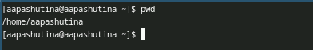
 
## Рис.2
 
- Переходим в каталог /tmp и просматриваем его содержимое.
 
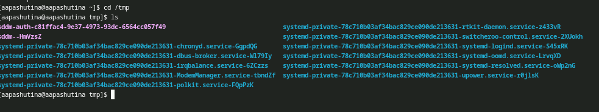
 
## Рис.3
 
- С помощью ключа -a выводим дополнительные (скрытые) файлы.
 
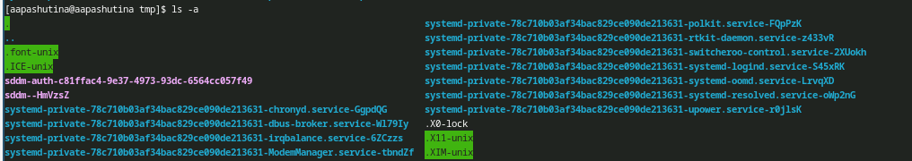
 
## Рис.4
 
- С помощью ключа -l выводим файлы с полной информацией.
 
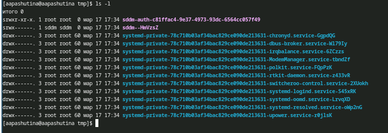
 
## Рис.5
 
- С помощью ключа -F определяем типы элементов.
 
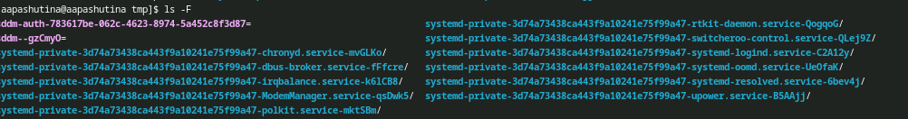
 
## Рис.6
 
- Используем все три ключа сразу для максимально подробного вывода.
 
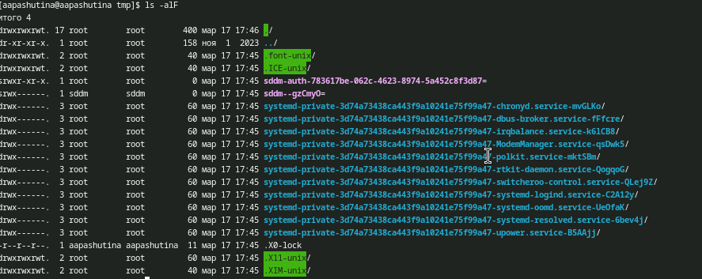
 
## Рис.7
 
- Проверяем наличие подкаталога cron в каталоге /var/spool.
 
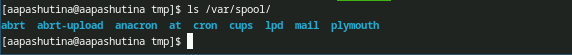
 
## Рис.8
 
- Переходим в домашний каталог и выводим подробный список файлов, определяем владельца.
 
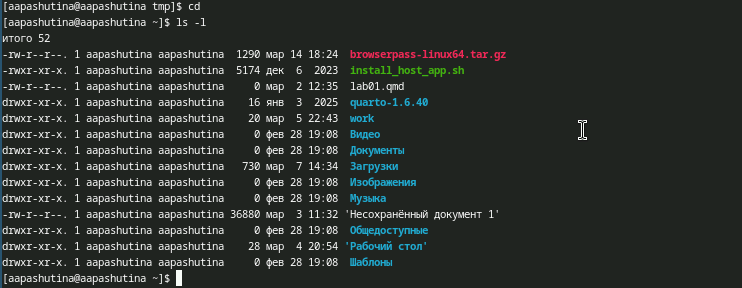
 
## Рис.9
 
- Создаем каталог newdir, внутри него — morefun. Создаем каталоги letters, memos, misk одной командой. Пробуем удалить newdir с помощью rm. Удаляем morefun с помощью rmdir.
 
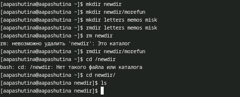
 
## Рис.10
 
- С помощью man определяем ключ для рекурсивного вывода содержимого подкаталогов — это ключ -R.
 

 
## Рис.11
 
- С помощью man определяем ключ для сортировки по времени последнего изменения — это ключ -t.
 

 
## Рис.12
 
- Изучаем ключи команды cd с помощью man.
 
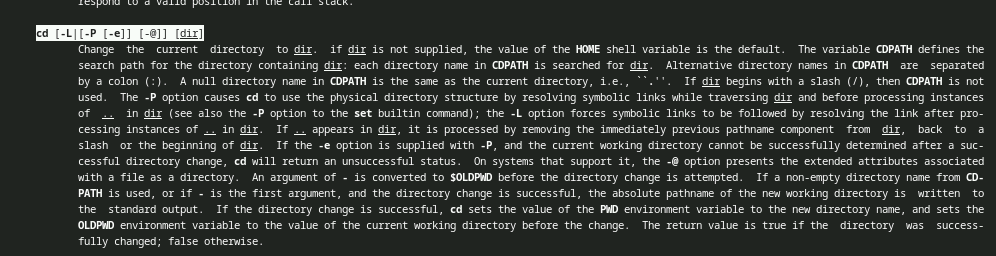
 
## Рис.13
 
- Изучаем ключи команды pwd с помощью man.
 
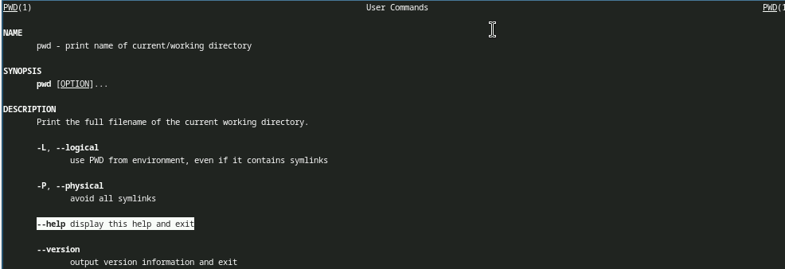
 
## Рис.14
 
- Изучаем ключи команды mkdir с помощью man.
 
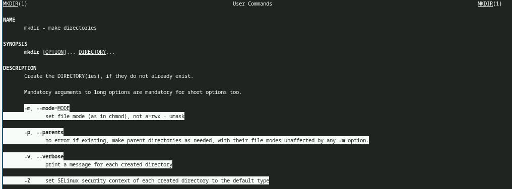
 
## Рис.15
 
- Изучаем ключи команды rmdir с помощью man.
 
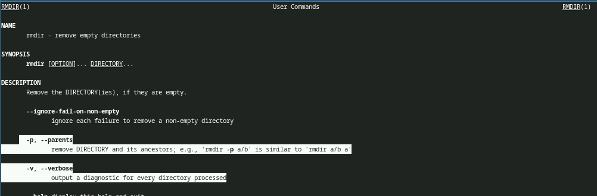
 
## Рис.16
 
- Изучаем ключи команды rm с помощью man.
 
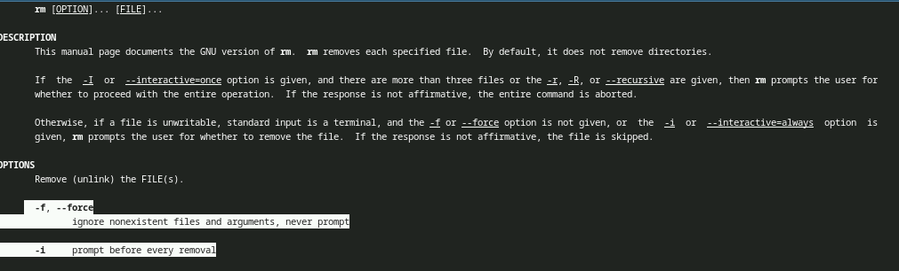
 
## Рис.17
 
- Выводим историю команд с помощью history.
 
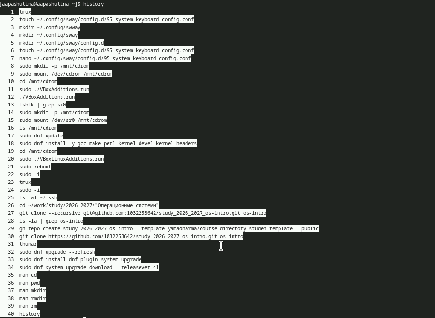
 
## Рис.18
 
- Пример использования изменённой команды из истории.
 
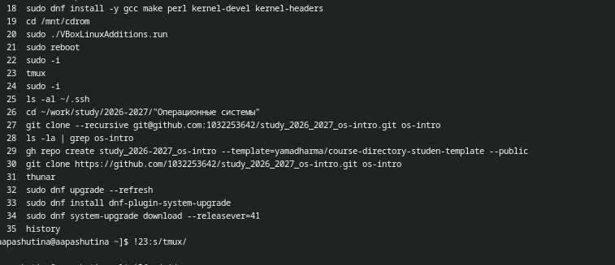
 
## Рис.19
 
- Ещё один пример использования изменённой команды из истории.
 
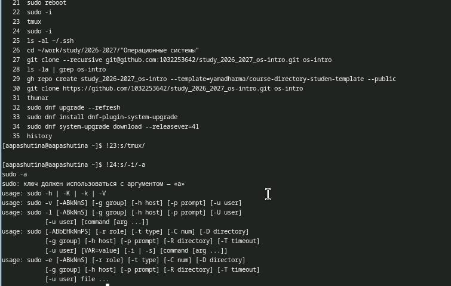
 
# Выводы
 
- В результате выполнения лабораторной работы были получены навыки работы с базовыми командами терминала
 
# Список литературы
 
- Команды Linux. [Электронный ресурс]. URL: https://www.opennet.ru/man.shtml (дата обращения: 20.03.2026)
- ТУИС. Лекция №6. [Электронный ресурс]. URL: https://esystem.rudn.ru (дата обращения: 20.03.2026)
