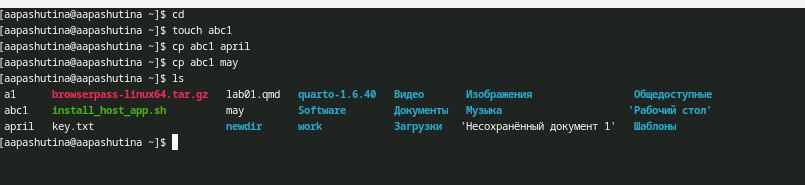
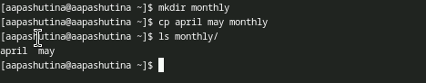
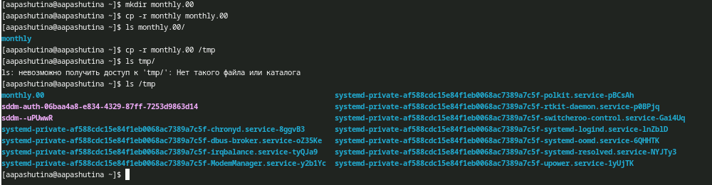
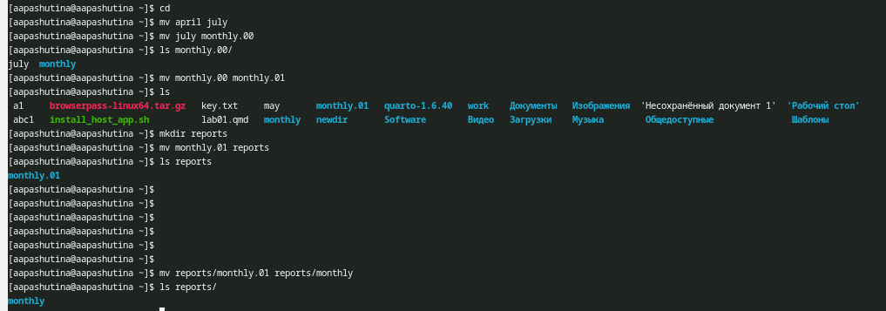
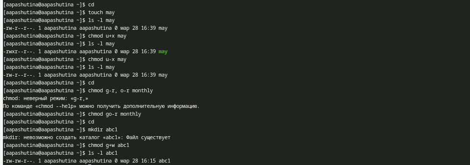
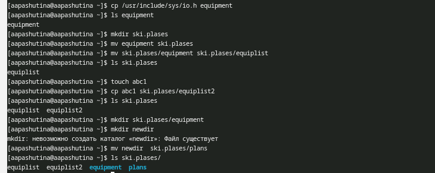
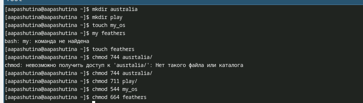
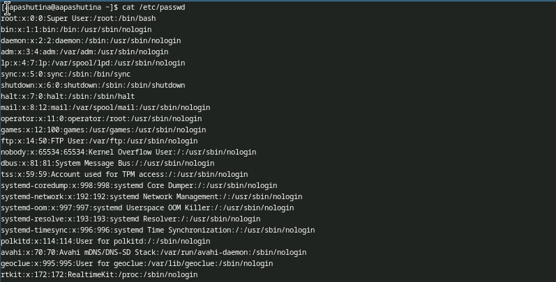
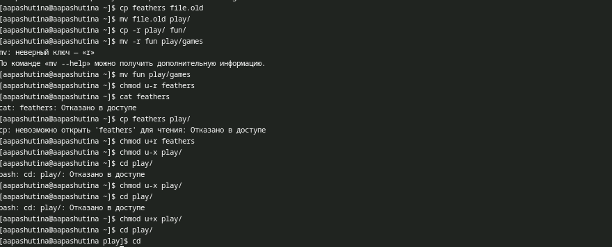
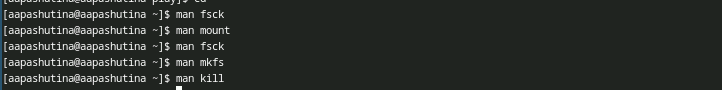

---
## Author
author:
  name: Пашутина Анна Алексеевна
  degrees: DSc
  orcid: 0000-0002-0877-7063
  email: 1032253642@rudn.ru
  affiliation:
    - name: Российский университет дружбы народов
      country: Российская Федерация
      postal-code: 117198
      city: Москва
      address: ул. Миклухо-Маклая, д. 6
## Title
title: Лабораторная работа №7
subtitle: Анализ файловой системы Linux. Команды для работы с файлами и каталогами.
license: CC BY
date: today
date-format: "YYYY-MM-DD"
 
## Fonts
mainfont: Liberation Serif
sansfont: Liberation Sans
monofont: Liberation Mono
mainfontoptions: Ligatures=TeX
romanfontoptions: Ligatures=TeX
sansfontoptions: Ligatures=TeX,Scale=MatchLowercase
monofontoptions: Scale=MatchLowercase,Scale=0.9
 
## Format for both PDF and HTML presentations
format:
  beamer:
    slide-level: 2
    aspectratio: 169
    theme: default
---
 
# Информация
 
## Докладчик
 
:::::::::::::: {.columns align=center}
::: {.column width="70%"}
 
  * Пашутина Анна Алексеевна
  * Студентка НПИбд-02-25
  * Российский университет дружбы народов им. П. Лумумбы
  * 1032253642@rudn.ru
 
:::
::: {.column width="30%"}
 
 
 
:::
::::::::::::::
# Цель работы
 
Ознакомление с файловой системой Linux, её структурой, именами и содержанием
каталогов. Приобретение практических навыков по применению команд для работы
с файлами и каталогами, по управлению процессами (и работами), по проверке исполь-
зования диска и обслуживанию файловой системы.
 

 
# Выполнение работы

## Рис.1
 
- Выполним примеры первого раздела. Создадим файл abc1 с пмощью команды touch. Скопируем файл abc1 с помощью команды cp
 

 
## Рис.2
 
- Cоздадим каталог monthly  и скопируем файлы april и may в каталог monthly.
 

 
## Рис.3
 
- Создадим каталог monthly.00 и скопируем каталог monthly в каталог monthly.00. Далее скопируем каталог monthly.00 в /tmp.
 

 
## Рис.4
 
- Изменим название файла april на july в домашнем каталоге. Переместим файл july в каталог monthly.00. Переименуем каталог monthly.00 в monthly.01. Cоздадим каталог reports. Переместим каталог monthly.01в каталог reports. Переименуем каталог
reports/monthly.01 в reports/monthly. 

 
## Рис.5
 
- Cоздадим файл ~/may с правом выполнения для владельца. Лишаем владельца файла ~/may права на выполнение. Cоздадим каталог monthly с запретом на чтение для членов группы и всех остальных пользователей. Cоздадим файл ~/abc1 с правом записи для членов группы.
 

 
## Рис.6
 
- Скопируем файл /usr/include/sys/io.h в домашний каталог и назовем его
equipment.Переименуем файл ~/ski.plases/equipment в ~/ski.plases/equiplist.Создадим в домашнем каталоге файл abc1 и скопируем его в каталог ~/ski.plases, назовем его equiplist2.  Переместим файлы ~/ski.plases/equiplist и equiplist2 в каталог ~/ski.plases/equipment. Создадим и переместим каталог ~/newdir в каталог ~ski.plases и назовем  его plans
 

 
## Рис.7
 
- Определим опции команды chmod, необходимые для того, чтобы присвоить перечисленным ниже файлам выделенные права доступа, считая, что в начале таких прав нет.
 

 
## Рис.8
 
- В разделе 4.1 посмотрим содерживое файла passwd с помощью команды cat.
 

 
## Рис.9
 
- Просмотрим содержимое файла /etc/password. Скопируем файл ~/feathers в файл ~/file.old. Переместим файл ~/file.old в каталог ~/play. Скопируем каталог ~/play в каталог ~/fun. Переместим каталог ~/fun в каталог ~/play и назовем его games. Лишим владельца файла ~/feathers права на чтение. Дадим владельцу файла ~/feathers право на чтение. Лишим владельца каталога ~/play права на выполнение. Перейдем в каталог ~/play. Дадим владельцу каталога ~/play право на выполнение
 

 
## Рис.10
 
- Прочитаем magn по командам mount, fsck, mkfs, kill и кратко их охарактеризуем, приведя примеры.
 

# Выводы
 
- В результате выполнения лабораторной работы были получены навыки работы с файлами и каталогами.

 
# Список литературы
 
- Команды Linux. [Электронный ресурс]. URL: https://www.opennet.ru/man.shtml 
- ТУИС. Лекция №7. [Электронный ресурс]. URL: https://esystem.rudn.ru 
