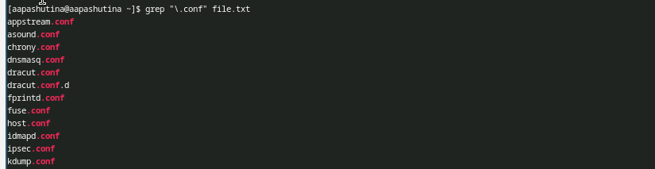
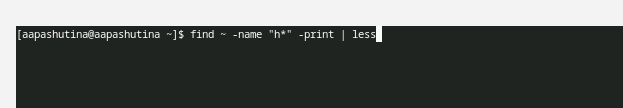
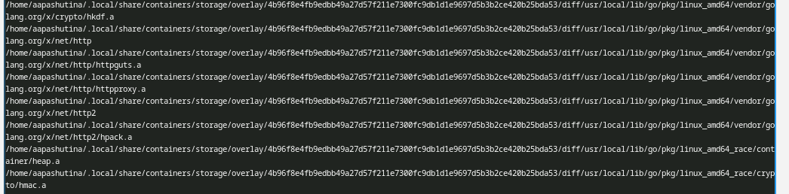
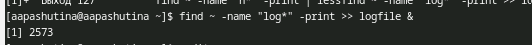
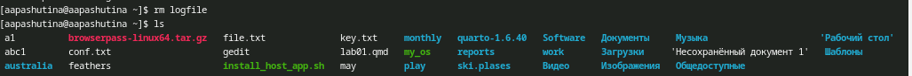
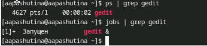
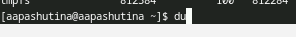
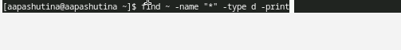
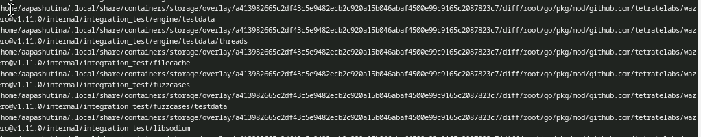

---
## Author
author:
  name: Пашутина Анна Алексеевна
  degrees: DSc
  orcid: 0000-0002-0877-7063
  email: 1032253642@rudn.ru
  affiliation:
    - name: Российский университет дружбы народов
      country: Российская Федерация
      postal-code: 117198
      city: Москва
      address: ул. Миклухо-Маклая, д. 6
## Title
title: Лабораторная работа №8
subtitle: Поиск файлов. Перенаправление ввода-вывода. Просмотр запущенных процессов
license: CC BY
date: today
date-format: "YYYY-MM-DD"
 
## Fonts
mainfont: Liberation Serif
sansfont: Liberation Sans
monofont: Liberation Mono
mainfontoptions: Ligatures=TeX
romanfontoptions: Ligatures=TeX
sansfontoptions: Ligatures=TeX,Scale=MatchLowercase
monofontoptions: Scale=MatchLowercase,Scale=0.9
 
## Format for both PDF and HTML presentations
format:
  beamer:
    slide-level: 2
    aspectratio: 169
    theme: default
---
 
# Информация
 
## Докладчик
 
:::::::::::::: {.columns align=center}
::: {.column width="70%"}
 
  * Пашутина Анна Алексеевна
  * Студентка НПИбд-02-25
  * Российский университет дружбы народов им. П. Лумумбы
  * 1032253642@rudn.ru
 
:::
::: {.column width="30%"}
 
 
 
:::
::::::::::::::

# Цель работы

Ознакомление с инструментами поиска файлов и фильтрации текстовых данных.
Приобретение практических навыков: по управлению процессами (и заданиями), по проверке использования диска и обслуживанию файловых систем.

# Выполнение работы

## Рис.1
 
- Запиcываю в файл file.txt названия файлов, содержащихся в каталоге /etc с помощью команды ls.
 

 
## Рис.2
 
- Дописываю в файл file.txt содержимое домашнего каталога с помощью >>
 

 
## Рис.3
 
- Выведем имена всех файлов из file.txt, имеющих расширение .conf с помощью команды grep
 

 
## Рис.4
 
- Выполним ту же команду, только перенаправим вывод в файл.

 
## Рис.5
 
- Найдём в домашнем каталоге файлы, которые начинаются на "c" с помощью команды find.
 

 
## Рис.6
 
- Мы увидем следующее:
 

 
## Рис.7
 
- Теперь выведем постранично файлы, которые начинаются на "h", с помощью того же find. Для этого создадим конвеер, и передадим вывод в команду less.
 

 
## Рис.8
 
- Увидим следующее:
 

 
## Рис.9
 
- Теперь запишем в файл имена файлов, начинающиеся с "log", но в фоновом режиме с помощью &
 

 
## Рис.10
 
- Содержимое будет выглядеть так
 

## Рис.11
 
- Удалим этот файл и выводим содержимео домашнего каталога с помощью команды ls, чтобы убедиться, что файл удален
 

 
## Рис.12
 
- Запустим gedit в фоновом режиме
 

 
## Рис.13
 
- Посмотрим на pid этого процесса с помощью ps 
 

 
## Рис.14
 
- Убьём процесс gedit по его pid
 

 
## Рис.15
 
- Посмотрим на размер доступного места в системе с помощью df 
 

 
## Рис.16
 
- И посмотрим на занимаемое место с помощью du
 

 
## Рис.17
 
- В выводе команды du видим следующее
 

 
## Рис.18
 
- Воспользовавшись справкой команды find, узнали, что нужно использовать -type d, чтобы вывести имена всех директорий, имею-
щихся в нашем домашнем каталоге.
 

 
## Рис.19
 
- Применив команду find, увидели следующее
 

 
# Выводы
 
- В результате выполнения лабораторной работы №8 были получены навыки работы с конвеером и перенаправлением потока вывода

 
# Список литературы
 
- Команды Linux. [Электронный ресурс]. URL: https://www.opennet.ru/man.shtml 
- ТУИС. Лекция №7. [Электронный ресурс]. URL: https://esystem.rudn.ru 
