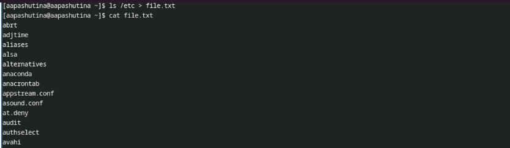
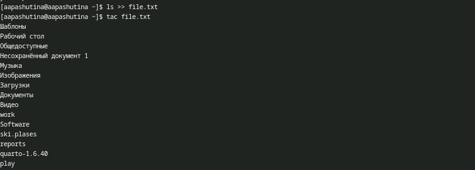
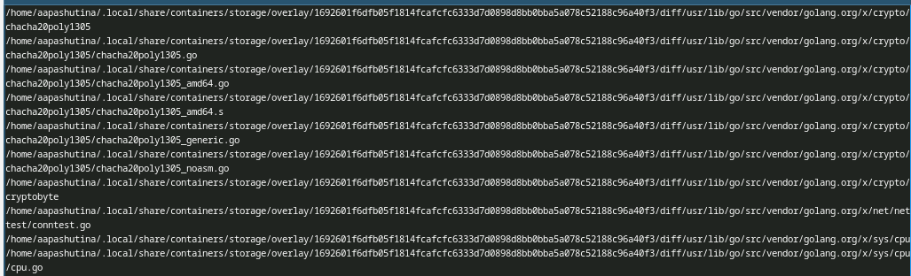
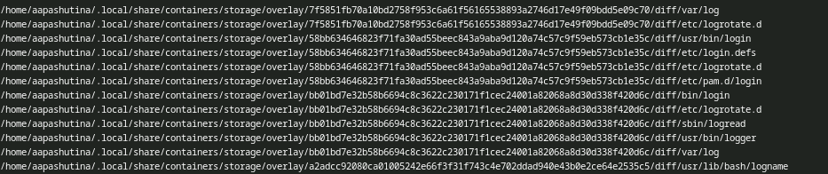
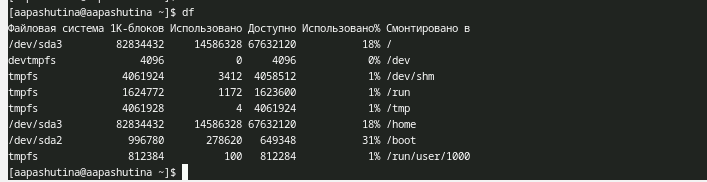
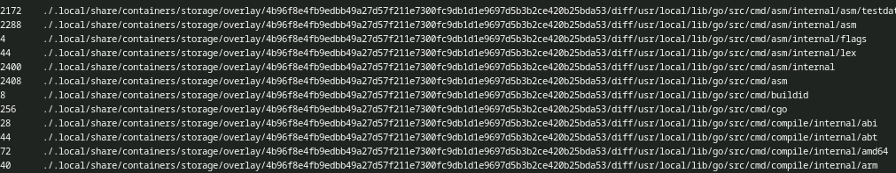

---
## Author
author:
  name: Пашутина Анна Алексеевна
  degrees: DSc
  orcid: 0000-0002-0877-7063
  email: 1032253642@rudn.ru
  affiliation:
    - name: Российский университет дружбы народов
      country: Российская Федерация
      postal-code: 117198
      city: Москва
      address: ул. Миклухо-Маклая, д. 6

## Title
title: "Лабораторная работа №8"
subtitle: "Отчет"
license: "CC BY"
---

# Цель работы

Ознакомление с инструментами поиска файлов и фильтрации текстовых данных.
Приобретение практических навыков: по управлению процессами (и заданиями), по проверке использования диска и обслуживанию файловых систем.

# Задание
1. Осуществите вход в систему, используя соответствующее имя пользователя.
2. Запишите в файл file.txt названия файлов, содержащихся в каталоге /etc. Допи-
шите в этот же файл названия файлов, содержащихся в вашем домашнем каталоге.
3. Выведите имена всех файлов из file.txt, имеющих расширение .conf, после чего
запишите их в новый текстовой файл conf.txt.
4. Определите, какие файлы в вашем домашнем каталоге имеют имена, начинавшиеся
с символа c? Предложите несколько вариантов, как это сделать.
5. Выведите на экран (по странично) имена файлов из каталога /etc, начинающиеся
с символа h.
6. Запустите в фоновом режиме процесс, который будет записывать в файл ~/logfile
файлы, имена которых начинаются с log.
7. Удалите файл ~/logfile.
8. Запустите из консоли в фоновом режиме редактор gedit.
9. Определите идентификатор процесса gedit, используя команду ps, конвейер и фильтр
grep. Как ещё можно определить идентификатор процесса?
10. Прочтите справку (man) команды kill, после чего используйте её для завершения
процесса gedit.
11. Выполните команды df и du, предварительно получив более подробную информацию
об этих командах, с помощью команды man.
12. Воспользовавшись справкой команды find, выведите имена всех директорий, имею-
щихся в вашем домашнем каталоге.

# Выполнение лабораторной работы

Запиcываю в файл file.txt названия файлов, содержащихся в каталоге /etc с помощью команды ls.(рис. 1)

{#fig-001 width=70%}

Дописываю в файл file.txt содержимое домашнего каталога с помощью >> (рис. 2)

{#fig-002 width=70%}

Выведем имена всех файлов из file.txt, имеющих расширение .conf с помощью команды grep (рис. 3)

{#fig-003 width=70%}

Выполним ту же команду, только перенаправим вывод в файл (рис. 4).

{#fig:004}

Найдём в домашнем каталоге файлы, которые начинаются на "c" с помощью команды find (рис. 5).

{#fig:005}

Мы увидем следующее (рис. 6).

{#fig:006}

Теперь выведем постранично файлы, которые начинаются на "h", с помощью того же find. Для этого создадим конвеер, и передадим вывод в команду less (рис. 7).

{#fig:007}

Увидим следующее (рис. 8).

{#fig:008}

Теперь запишем в файл имена файлов, начинающиеся с "log", но в фоновом режиме с помощью & (рис. 9).

{#fig:009}

Содержимое будет выглядеть так (рис. 10).

{#fig:010}

Удалим этот файл и выводим содержимео домашнего каталога с помощью команды ls, чтобы убедиться, что файл удален(рис. 11).

{#fig:011}

Запустим gedit в фоновом режиме (рис. 12).

{#fig:012}

Посмотрим на pid этого процесса с помощью ps (рис. 13).

{#fig:013}

Убьём процесс gedit по его pid (рис. 14).

{#fig:014}

Посмотрим на размер доступного места в системе с помощью df (рис. 15).

{#fig:015}

И посмотрим на занимаемое место с помощью du (рис. 16).

{#fig:016}

В выводе команды du видим следующее (рис. 17)

{#fig:017}

Воспользовавшись справкой команды find, узнали, что нужно использовать -type d, чтобы вывести имена всех директорий, имею-
щихся в нашем домашнем каталоге. (рис. 18)

{#fig:018}

Применив команду find, увидели следующее (рис. 19)

{#fig:019}

# Контрольные вопросы
 
1. В системе по умолчанию открыты три особых потока:
stdin — это стандартный поток ввода (по умолчанию это клавиатура), его файловый дескриптор равен 0.  
stdout — это стандартный поток вывода (по умолчанию это консоль), его файловый дескриптор равен 1.  
stderr — это стандартный поток вывода сообщений об ошибках (по умолчанию это консоль), его файловый дескриптор равен 2.  
 
2. Символ > используется для перенаправления ввода/вывода, а символ » используется для перенаправления в режиме добавления.  
 
3. Конвейер (pipe) используется для объединения отдельных команд или утилит в цепочку, в которой вывод одной команды передается на вход следующей команды.  
 
4. Основное различие между программой и процессом заключается в том, что программа представляет собой набор инструкций, предназначенных для выполнения определенной задачи центральным процессором (ЦПУ), в то время как процесс - это экземпляр исполняемой программы, который активно выполняется в операционной системе.  
 
5. PID (Process ID) - это идентификатор процесса, который уникально идентифицирует каждый запущенный процесс в операционной системе.  
GID (Group ID) - это идентификатор группы, который определяет принадлежность процесса к определенной группе пользователей в операционной системе.  
 
6. Программы, запущенные в фоновом режиме, действительно называются задачами (jobs). Управлять ими можно с помощью команды jobs, которая выводит список запущенных в данный момент задач.  
 
7. Команда htop и команда top выполняют аналогичные функции, показывая информацию о процессах в реальном времени и отображая данные о потреблении системных ресурсов. Обе команды также предоставляют возможность поиска, остановки и управления процессами.  
Однако у них есть различия и преимущества. Например, в htop реализован более удобный поиск и фильтрация процессов, что делает его использование более интуитивно понятным по сравнению с top, где для активации функции поиска требуется знать соответствующую комбинацию клавиш.  
С другой стороны, в top можно разделить область окна и настроить отображение информации о процессах согласно различным настройкам, что делает его более гибким в настройке отображения.  
 
8. Команда find является одной из наиболее важных и часто используемых утилит в системе Linux. Она предназначена для поиска файлов и каталогов на основе определенных условий. find можно применять в различных сценариях, таких как поиск файлов по разрешениям, владельцам, группам, типу, размеру и другим подобным критериям.  
Утилита find по умолчанию предустановлена во всех дистрибутивах Linux, что обеспечивает готовность к использованию без необходимости установки дополнительных пакетов. Это делает find важным инструментом для эффективной работы в командной строке Linux.  
Синтаксис команды find следующий: find путь параметры критерий действие. Например: find /etc -name "p*" -print - это команда, которая ищет файлы, начинающиеся с символа "p" в каталоге /etc и выводит результаты поиска.  
 
9. Да, можно использовать команду find в сочетании с grep для поиска текста в файлах. Пример использования:  
find / -type f -exec grep -H 'ТЕКСТ' {};  
Эта команда будет рекурсивно искать файлы в корневом каталоге / и его подкаталогах. Затем она передаст каждый найденный файл в качестве аргумента команде grep, которая выполнит поиск строки 'ТЕКСТ' в каждом файле. Результатом будут строки с соответствующим текстом и именами файлов, в которых он найден.  
 
10. С помощью df -h  
 
11. С помощью команды du -s  
 
12. С помощью команды kill PID  

# Выводы

В результате выполнения лабораторной работы №8 были получены навыки работы с конвеером и перенаправлением потока вывода

# Список литературы{.unnumbered}

::: {#refs}
:::
