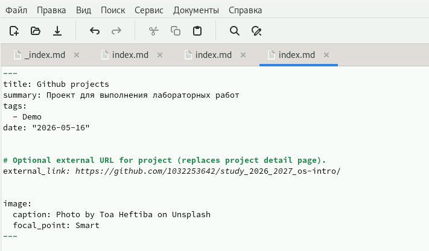
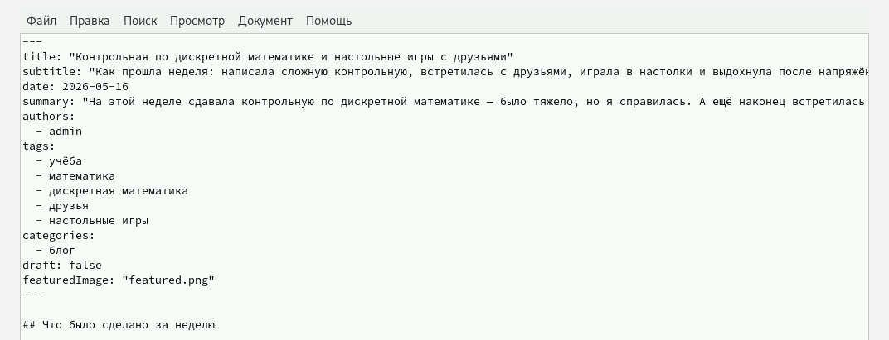
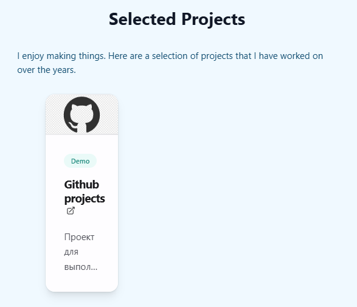

---
## Author
author:
  name: Пашутина Анна Алексеевна
  degrees:
  orcid:
  affiliation:
    - name: Российский университет дружбы народов
      country: Российская Федерация
      postal-code: 117198
      city: Москва
      address: ул. Миклухо-Маклая, д. 6
## Title
title: Выполнение индивидуального проекта
subtitle: Этап 5
license: CC BY
date: today
date-format: "YYYY-MM-DD"
 
## Fonts
mainfont: Liberation Serif
sansfont: Liberation Sans
monofont: Liberation Mono
mainfontoptions: Ligatures=TeX
romanfontoptions: Ligatures=TeX
sansfontoptions: Ligatures=TeX,Scale=MatchLowercase
monofontoptions: Scale=MatchLowercase,Scale=0.9
 
## Language
lang: ru-RU
 
## Format
format:
  beamer:
    aspectratio: 169
    slide-level: 2
    latex-engine: xelatex
    include-in-header:
      - \usepackage{polyglossia}
      - \setmainlanguage{russian}
      - \setotherlanguage{english}
---
 
# Информация
 
## Докладчик
 
:::::::::::::: {.columns align=center}
::: {.column width="70%"}
 
  * Пашутина Анна Алексеевна
  * Студентка
  * Российский университет дружбы народов
  * 1032253642@rudn.ru
  * группа НПИ-Бл-02-25
 
:::
::: {.column width="30%"}
 
:::
::::::::::::::

## Цель

- Создать индивидуальный сайт, постепенно его заполняя.

## Задание

- Добавить с сайту все остальные элементы.
- Сделать записи для персональных проектов.
- Сделать пост по прошедшей неделе.
- Добавить пост на тему по выбору: языки научного программирования.

## Оформление проекта 

- Добавим в файл index.md нашего проекта ссылку на свой гитхаб. 

{width=70%}

## Фото для ссылки 

- Создаю аватарку для ссылки на проект гитхаб на сайте. 

{width=70%}

## Пост по прошедшей неделе

- Пишем пост о прошедшей неделе.

{width=70%}

## Пост о языках программирования

- Пишем пост о языках программирования: какой лучше выбрать новичку? 

{width=70%}

## Ссылка на гитхаб-проект на сайте

- Так выглядит ссылка на мой гитхаб-проект на моем сайте. 

{width=70%}

## Пост о языках прораммирования на сайте

- Так выглядит пост о языках программирования на моем сайте.

{width=70%}

## Пост по прошедшей неделе на сайте

- Так выглядит пост о прошедшей неделе на моем сайте.

{width=70%}

# Выводы

- В результате работы были добавлены проекты и новые посты.

# Список литературы{.unnumbered}

::: {#refs}
:::

