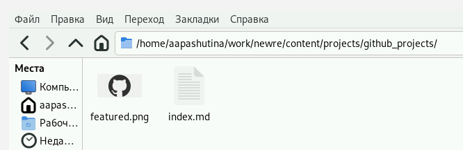
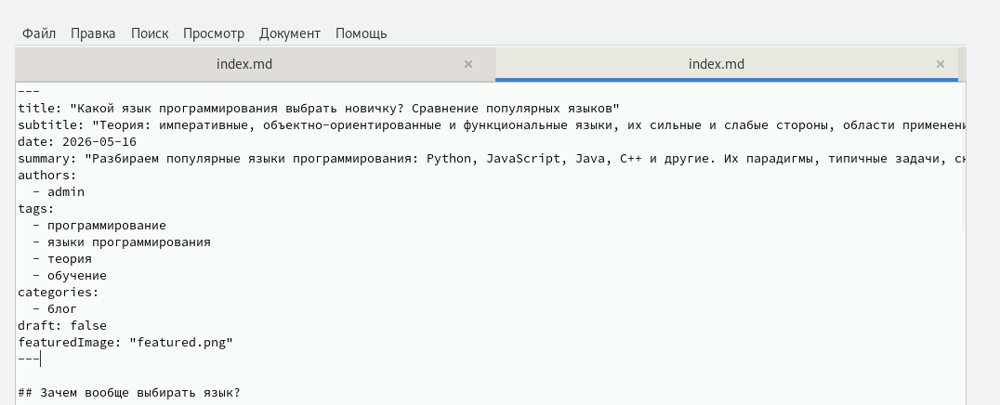
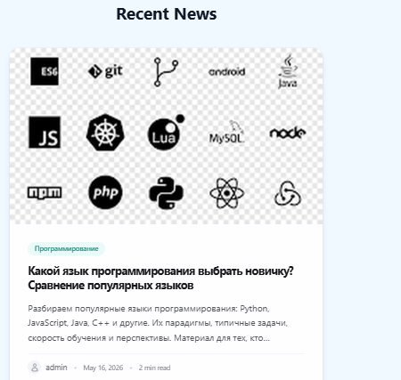
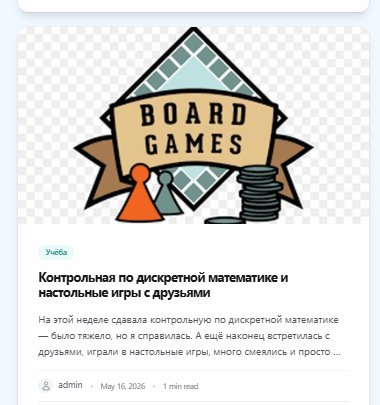

---
## Front matter
title: "Отчёт по выполнению индивидуального проекта"
subtitle: "Этап 5"
author: "Пашутина Анна Алексеевна"
 
## Generic options
lang: ru-RU
toc-title: "Содержание"
 
## Pdf output format
toc: true
toc-depth: 2
lof: true
lot: false
fontsize: 12pt
linestretch: 1.5
papersize: a4
documentclass: scrreprt
 
## I18n polyglossia
polyglossia-lang:
  name: russian
  options:
    - spelling=modern
    - babelshorthands=true
polyglossia-otherlangs:
  name: english
 
## Fonts
mainfont: Liberation Serif
sansfont: Liberation Sans
monofont: Liberation Mono
mainfontoptions: Ligatures=TeX
romanfontoptions: Ligatures=TeX
sansfontoptions: Ligatures=TeX,Scale=MatchLowercase
monofontoptions: Scale=MatchLowercase,Scale=0.9
 
## Misc options
indent: true
header-includes:
  - \usepackage{indentfirst}
  - \usepackage{float}
  - \floatplacement{figure}{H}
---

# Цель работы

Создать индивидуальный сайт, постепенно его заполняя.

# Задание

1)Добавить с сайту все остальные элементы.
2)Сделать записи для персональных проектов.
3)Сделать пост по прошедшей неделе.
4)Добавить пост на тему по выбору:
  Языки научного программирования.

# Выполнение лабораторной работы

Добавим в файл index.md нашего проекта ссылку на свой гитхаб. ([рис. @fig-001])

{#fig-001 width=70%}

Создаю аватарку для ссылки на проект гитхаб на сайте. ([рис. @fig-002])

{#fig-002 width=70%}

Пишем пост о прошедшей неделе. ([рис. @fig-003])

{#fig-003 width=70%}

Пишем пост о языках программирования: какой лучше выбрать новичку? ([рис. @fig-004])

{#fig-004 width=70%}

Так выглядит ссылка на мой гитхаб-проект на моем сайте. ([рис. @fig-005])

{#fig-005 width=70%}

Так выглядит пост о языках программирования на моем сайте. ([рис. @fig-006])

{#fig-006 width=70%}

Так выглядит пост о прошедшей неделе на моем сайте. ([рис. @fig-007])

{#fig-007 width=70%}

# Выводы

В результате работы были добавлены проекты и новые посты.

# Список литературы{.unnumbered}

::: {#refs}
:::
